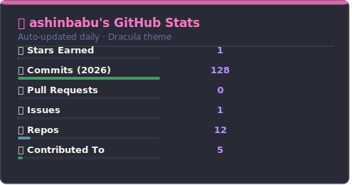

# Hi, I'm Ashin Babu 👋

  
  
  
  

---

## 🧑‍💻 About Me

- 🎓 **Research Scholar** at BITS Pilani — Department of Computer Science and Information Systems
- 🔬 Passionate about **Software Engineering research**, building robust systems, and exploring emerging tech
- 🛠 I enjoy working across the stack — from low-level **C++** to **Python** scripting to **ReactJS** frontends
- 📸 When I'm not coding, I'm probably behind a camera
- 📬 Reach me at **ashin33149@gmail.com** or **ashin.babu@pilani.bits-pilani.ac.in**

---

## 🛠 Skills & Technologies

### Languages

### Frameworks & Libraries

### Tools & Platforms

### Research Interests

---

## 📊 GitHub Stats

  

  

  

---

## 🗂 Featured Projects

> 🚧 Projects section — highlights of my work. Check my [repositories](https://github.com/ashinbabu?tab=repositories) for everything.

| Project | Description | Stack |
|---------|-------------|-------|
| 🔬 **Research Work** | Ongoing research at BITS Pilani — CSIS Dept | Python, Academic Writing |
| 📷 **Photography Portfolio** | Visual storytelling through the lens | Photography |

_More coming soon as projects go public!_

---

## 🎓 Education

| Degree | Institution | Period |
|--------|-------------|--------|
| 🎓 **Research Scholar** — Computer Science & Information Systems | BITS Pilani, Rajasthan | 2025 – Present |
| 🏆 **M.Tech** — Computer Science (Software Engineering) | CUSAT, Kochi, Kerala | 2022 – 2024 |
| ⚡ **B.Tech** — Electrical & Electronics Engineering | CUSAT, Kochi, Kerala | 2016 – 2020 |

---

_"Code is like humor. When you have to explain it, it's bad."_

